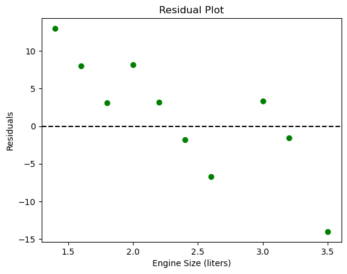

# CO2-Emissions-Prediction

This project investigates the relationship between engine size and CO₂ emissions using a linear regression model. It analyzes vehicle data to identify patterns and evaluates how well the model captures the underlying trends. The goal is to understand emission behavior and assess model performance with residual analysis.

---

## 📁 Project Structure

---

## 🎯 Objectives

- Explore how engine size affects CO₂ emissions
- Train a linear regression model to predict emissions
- Evaluate model performance using residual plots
- Interpret residual patterns for model improvement

---

## 🛠 Tools & Libraries Used

- Python
- Pandas
- Matplotlib & Seaborn
- Scikit-learn
- Jupyter Notebook

---

## 📊 Visualizations

## Residual Plot

This plot displays a clear pattern, where residuals are positive for smaller engines (~ 1.5 - 2.3L) and transitions to negative for larger engines (~ 2.5 - 3.5L).  The pattern suggests that the linear model is not capturing the relationship between engine size and CO2 emissions adequately.

---

## 🔍 Key Insights

- The linear regression model underestimates emissions for larger engine sizes and overestimates for smaller ones.
- A nonlinear model or interaction terms may better capture the true pattern.
- Additional features like fuel type or vehicle weight could improve prediction.

---

## 🚀 Future Improvements

- Try polynomial or non-linear regression
- Use feature selection or interaction terms
- Evaluate performance using cross-validation
- Build a dashboard to visualize predictions and residuals interactively

---

## 👤 Author

**Edidiong Ibokette**  
Graduate Student | Data Analyst  
GitHub: [Eddy-bok](https://github.com/Eddy-bok)
